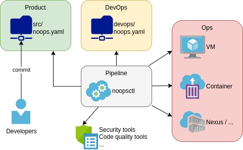

# NoOps Command line utility

`noopsctl` is an utility which handle noops compliant repositories.

A noops compliant repository (product) exposes `noops.yaml` with multiple directives.
The devops part can be a remote resource with its own `noops.yaml` file.

`noopsctl` will provide an efficient way to handle this kind of repository for pipeline (CI/CD) or local build and run (Developers computer).




[TOC]

## NoOps

The main target is to remove all the friction and management relative to infrastructure/operations. Whatever is the target, we still need an ecosystem to execute an application and a workflow to set it.

So the most important is **how to do it**.

NoOps is here to reduce the pain and to permit developers to focus on the application code only. That sound like the promise of DevOps, CI/CD pipeline etc. In reality, DevOps, CI/CD... are still needed but will be hidden or simplified as much as possible. Some external tools like Service Catalog with [Open Service Broker API](https://www.openservicebrokerapi.org/) or [Operators](https://kubernetes.io/docs/concepts/extend-kubernetes/operator/) will help to handle the ecosystem required to run the application (eg: storage, database, ... provisioning).

All those practices and tools together permit to achieve the **NoOps target**.


### What noopsctl does

- Compute the final `noops.yaml` based on product and devops definitions
- Built-in understanding of few `noops.yaml` keys (eg: `service-catalog`, `package.helm`, ...)
- Create service catalog files based on `service-catalog`
- Select and execute external scripts/binaries to do a CI, CD, local build, local run, etc
- Handle `white-label`
- ...

### What noopsctl does NOT do

- Define a CI/CD strategy
- Define how to build a product
- Communicate directly with a service provider to create infrastructures

## Documentation

| Link                                                         | Short purpose description                                 |
| ------------------------------------------------------------ | --------------------------------------------------------- |
| [workflow](docs/README.d/workflow.md)                        | How NoOps is working                                      |
| [reserved keys](docs/README.d/reserved.md)                   | Reserved noops.yaml keys                                  |
| [package](docs/README.d/package.md)                          | Package definition (helm, kustomize, ...)                 |
| [service-catalog](docs/README.d/service-catalog.md)          | Service Catalog support                                   |
| [white-label](docs/README.d/white-label.md)                  | White-label support                                       |
| [pipeline and local](docs/README.d/pipeline-local.md)        | Pipeline and local support (build, ci, cd, ...)           |
| [profile](docs/README.d/profile.md)                          | Profiles support                                          |
| [cli](docs/README.d/cli.md)                                  | Command line references for noopsctl                      |
| [NoOps Helm Package (Experimental)](docs/README.d/x-noops-helm-package.md) | Helm package                                              |
| [Versions (Experimental)](docs/README.d/x-versions.md)       | Product versions to use                                   |
| [Targets (Experimental)](docs/README.d/x-targets.md)         | Product cluster targets                                   |
| [Projects (Experimental)](docs/README.d/x-projects.md)       | Product deployment (Versions, White-label, settings, ...) |

## Development

### Prerequisites

```bash
$ pip install -r requirements.txt
```

### coverage

```bash
$ coverage run -m unittest
$ coverage report -m
```

### lint

```bash
$ pylint noops/ tests/
```

## Todo

- helper to create
  - a NoOps Helm chart from scratch (with or without default built-in structure)
  - kustomize structure
  - a new pre-processing script
  - a new service-catalog external script
- do not generate profile/target not compatible with the package (`package.supported`)
- better exception handling for the cli to display more Human readable errors
- support Helm repositories v1 !? *(Nexus helm repositories)*
- implement `noopsctl x projects apply` (with kubernetes context switcher)
- check if `svcat.yaml` is copied at the right place ! *(possible bug for Experimental NoOps Helm Package)*
- environment support for `service-catalog` and `white-label` with an `environments` array
